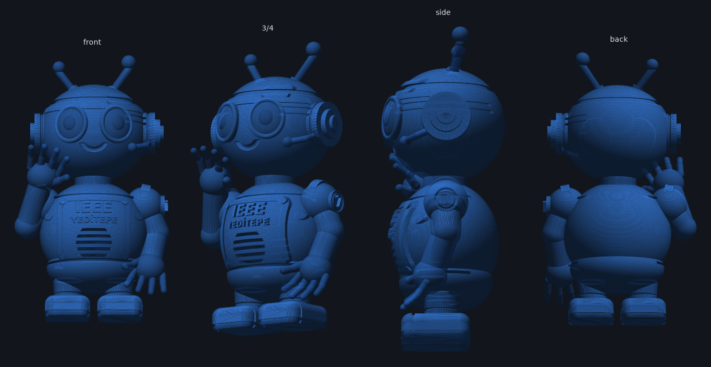
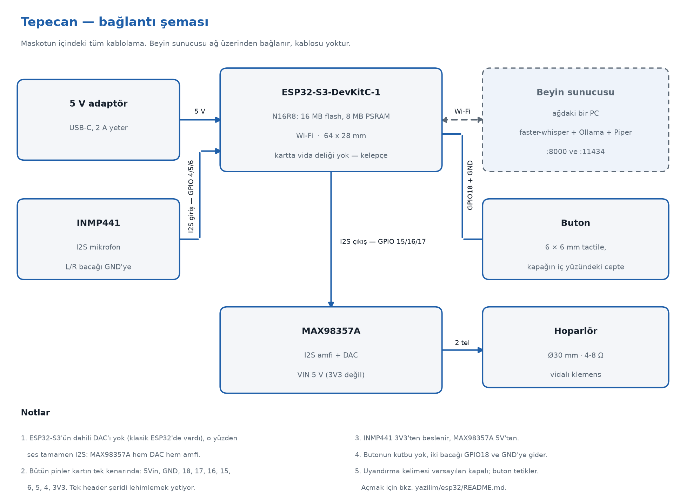

# Tepecan

Yeditepe IEEE kulübünün resmi maskotu — 3D baskı gövde ve içine giren sesli
asistan. Dinler, sorulanı yapay zekâya iletir, cevabı Türkçe olarak
hoparlöründen söyler.

<p align="center">
  
</p>

- **240 mm** boy, tek parça basılan gövde
- Sırtta **vidalı kapak** (73 × 62 mm açıklık), içinde 90 × 75 × 87 mm bölme
- Göğüste kabartma **IEEE** ve **YEDİTEPE**, sol omuzda **7** rozeti
- **"Hey Tepecan"** ile butonsuz tetikleme (yerel, openWakeWord)
- Beyin ağdaki bir PC'de çalışır: **token maliyeti yok, internet gerekmez**

---

## Depoda ne var

```
govde/        3D model — parametrik script, baskıya hazır STL'ler, önizlemeler
yazilim/      esp32/ (maskotun içindeki firmware) ve sunucu/ (ses↔metin↔cevap)
dokuman/      yapım kılavuzu (PDF), bağlantı şeması, üretim scriptleri
```

**Başlarken okunacak tek dosya:** [`dokuman/Tepecan_Yapim_Kilavuzu.pdf`](dokuman/Tepecan_Yapim_Kilavuzu.pdf)
— malzeme listesinden montaja, kuruluma ve sorun gidermeye kadar her şey orada.

---

## Nasıl çalışıyor

```
   MASKOT (ESP32-S3)                       BEYİN SUNUCUSU (bir PC)
   "Hey Tepecan" / buton
   mikrofon kaydeder      ──── Wi-Fi ───▶  /stt    faster-whisper   (ses → metin)
                                           :11434  Ollama, qwen3:4b (cevabı üretir)
   hoparlör çalar         ◀─── Wi-Fi ────  /tts    Piper            (metin → ses)
```

Maskotun içindeki kartın tek işi mikrofonu okuyup hoparlöre yazmak. Ses→metin,
dil modeli ve metin→ses, ağdaki bir bilgisayarda çalışır. Bu yüzden 512 MB
RAM'li küçük bir kart yetiyor ve kullanım başına maliyet oluşmuyor.

Cevap tamamlanmadan konuşmaya başlar: model ilk cümleyi bitirir bitirmez o
cümle seslendirilir, kalanı arka planda üretilir.

<p align="center">
  
</p>

---

## Gövde

```bash
cd govde
pip install -r requirements.txt
python3 tepecan_model.py                 # 240 mm, stl/ klasörünü üretir
python3 tepecan_model.py --height 180    # daha küçük baskı, cidar yine 3 mm
python3 preview_render.py                # önizleme görselleri
python3 dogrula.py                       # elektronik gerçekten sığıyor mu
```

| Dosya | Ne |
|---|---|
| `stl/tepecan_body.stl` | İçi boş gövde — sırt açıklığı, kapak kenarı, vida boss'ları, hoparlör adası, kart kuleleri |
| `stl/tepecan_lid.stl` | Sırt kapağı, baskı pozisyonunda |
| `stl/tepecan_buton.stl` | Kapaktaki butonun kapağı (Ø10 mm başlık, 5 mm sap) |
| `stl/tepecan_plaka.stl` | Kart tepsisi (72 × 36 × 3 mm, ~20 dk) |
| `stl/tepecan_solid.stl` | İçi dolu vitrin figürü (elektronik yoksa bunu bas) |
| `stl/tepesu.stl` | Tepesu: elektroniksiz ikiz, kaldırdığı elinde QR kartı klipsi |

Figür tasarım biriminde modellenip export'ta ölçekleniyor; cidar kalınlığı,
vida delikleri ve kapak boşluğu gibi mutlak kalması gereken ölçüler önce bu
ölçeğe bölünüyor — böylece M3 vida her boyda M3 kalıyor.

Script her STL'i yazdıktan sonra dosyayı geri okuyup kapalı (watertight),
tutarlı normalli, tek parça ve pozitif hacimli olduğunu doğruluyor; geçmezse
hata verip duruyor.

`dogrula.py` bir adım öteye gidiyor: gerçek parçaların zarflarını (65 × 30 × 18 mm
kart, Ø30 mm hoparlör, 6 × 6 × 4.3 mm switch) basılmış STL'in içine yerleştirip
boolean kesişime bakıyor. Sıfır olmayan her kesişim, o parçanın gövdeye girmediği
anlamına geliyor. Hangi kartın alınacağı belli olmadığı için kavitenin kabul
ettiği en büyük kart zarfını da ölçüp yazdırıyor.

**Kart gövdeye kilitli değil.** Gövdede yalnız genel amaçlı dört kule var;
karta özel her şey ayrı basılan `tepecan_plaka.stl` tepsisinde. Kart
değişirse 30-45 saatlik gövde değil, 20 dakikalık tepsi yeniden basılıyor —
`BOARD_HOLE_X` / `BOARD_HOLE_Y` (gerekirse `BOARD_OFFSET_Y`) değiştirilip
yeniden üretiliyor.

| İç ölçü | Değer |
|---|---|
| Kapak açıklığı / geçiş | 73 × 62 mm / 65 × 54 mm |
| Gövde kuleleri | Ø6 mm, 44 × 28 mm aralık (karttan bağımsız), üstleri tabandan 63.8 mm'de |
| Kule kılavuz deliği | Ø2.1 mm × 8 mm (M2.5 kendinden kılavuzlu) |
| Kart tepsisi | 72 × 36 × 3 mm, kart kelepçeyle bağlanıyor |
| Kart için yer | 69.5 × 30, 63.4 × 40-55 mm; tepsi üstünde 40 mm yükseklik |
| Hoparlör yuvası | ızgara Ø30 mm, cep Ø32 mm, düz omuz |
| Kapak vidası | 2 × M3, Ø18.7 mm boss, 12 mm derin |
| Buton | kapakta, Ø4.2 mm delik + 6.6 mm kare cep |
| Kablo yuvası | 15.6 × 7.8 mm, tabandan 38 mm'de |
| Cidar | 3 mm |

**Baskı:** PLA, 0.20 mm katman, 3 perimetre, %10-15 dolgu, ağaç destek açık,
5 mm brim. Z ekseni ≥ 250 mm olan yazıcı gerekiyor.

---

## Yazılım

**Sunucu** (kulüpteki PC):

```bash
curl -fsSL https://ollama.com/install.sh | sh
ollama pull qwen3:4b
OLLAMA_HOST=0.0.0.0 ollama serve

cd yazilim/sunucu
pip install -r requirements.txt
uvicorn beyin:app --host 0.0.0.0 --port 8000
```

**Maskot** — ESP32-S3 (`yazilim/esp32/`, ESP-IDF):

```bash
cd yazilim/esp32
idf.py set-target esp32s3 && idf.py build
idf.py -p /dev/ttyUSB0 flash monitor
```

Wi-Fi bilgisi koda gömülü değil: kart ilk açılışta `Tepecan-Kurulum`
erişim noktasını açıyor, telefondan `http://192.168.4.1` üzerinden ağ ve
sunucu adresi giriliyor. Ayrıntılar ve uyandırma kelimesi modelinin
eğitimi: [`yazilim/esp32/README.md`](yazilim/esp32/README.md).

Sırt kapağındaki **butona bas** — kayıt sen susunca kendiliğinden biter.
**"Hey Tepecan"** ile uyandırma da kodda var ama varsayılan kapalı: ifadeye
özel eğitilmiş bir microWakeWord modeli gerekiyor. Açma yolu ve model eğitimi
[`yazilim/esp32/README.md`](yazilim/esp32/README.md) içinde.

### Ayarlar

| Değişken | Varsayılan | Ne işe yarar |
|---|---|---|
| `TEPECAN_BRAIN` | `http://tepecan-beyin.local` | Beyin sunucusunun adresi |
| `TEPECAN_MODEL` | `qwen3:4b` | Ollama'da kullanılacak model |
| `TEPECAN_LLM_BACKEND` | `ollama` | `ollama` veya `claude` |
| `TEPECAN_BUTTON_PIN` | `17` | Butonun bağlı olduğu GPIO |
| `TEPECAN_WAKE_MODEL` | `~/tepecan/hey_tepecan.onnx` | Uyandırma modeli; yoksa sadece buton |
| `TEPECAN_WAKE_THRESHOLD` | `0.5` | Uyandırma eşiği (yükselt = az yanlış tetikleme) |
| `STT_MODEL` / `STT_DEVICE` | `small` / `cpu` | Sunucuda whisper boyutu ve cihazı |
| `PIPER_MODEL` | `~/piper/tr_TR-dfki-medium.onnx` | Sunucuda Türkçe ses modeli |

### Küçük modelden iyi cevap almak

Model 4 milyar parametreli; ondan bilgiyi *bilmesini* değil, verdiğimiz metni
*okumasını* istiyoruz. Kaliteyi belirleyen sıra:

1. **`yazilim/sunucu/bilgiler.txt` dosyasını doldur.** Kulübe dair her gerçek
   buraya; her soruda modele veriliyor. Doğru cevabı sağlayan asıl mekanizma bu.
2. `persona.txt` içindeki 2-3 cümle sınırını gevşetme — küçük modeller
   uzadıkça dağılır.
3. Hafıza 6 mesajla sınırlı ve 3 dakika sessizlikte sıfırlanıyor; artırma.

---

## Lisans

MIT — bkz. [LICENSE](LICENSE).
